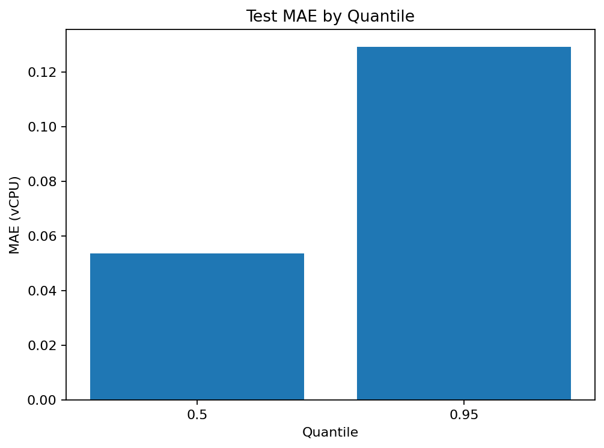
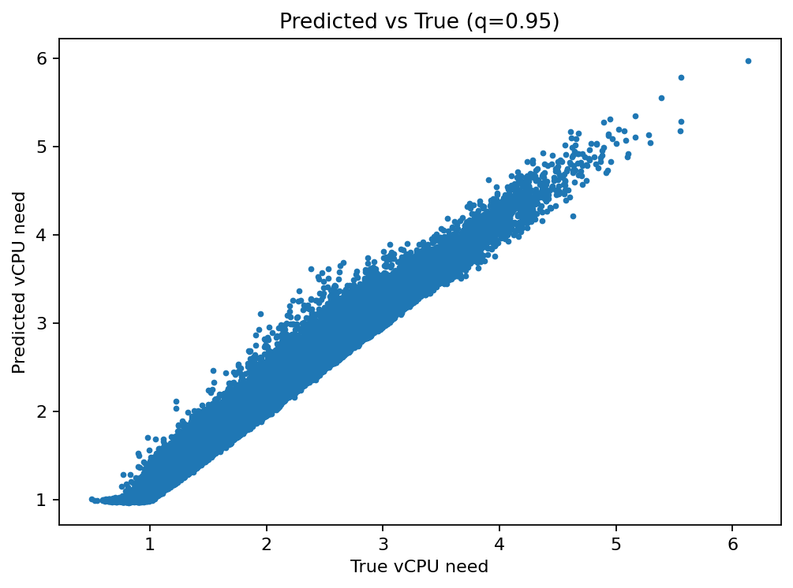
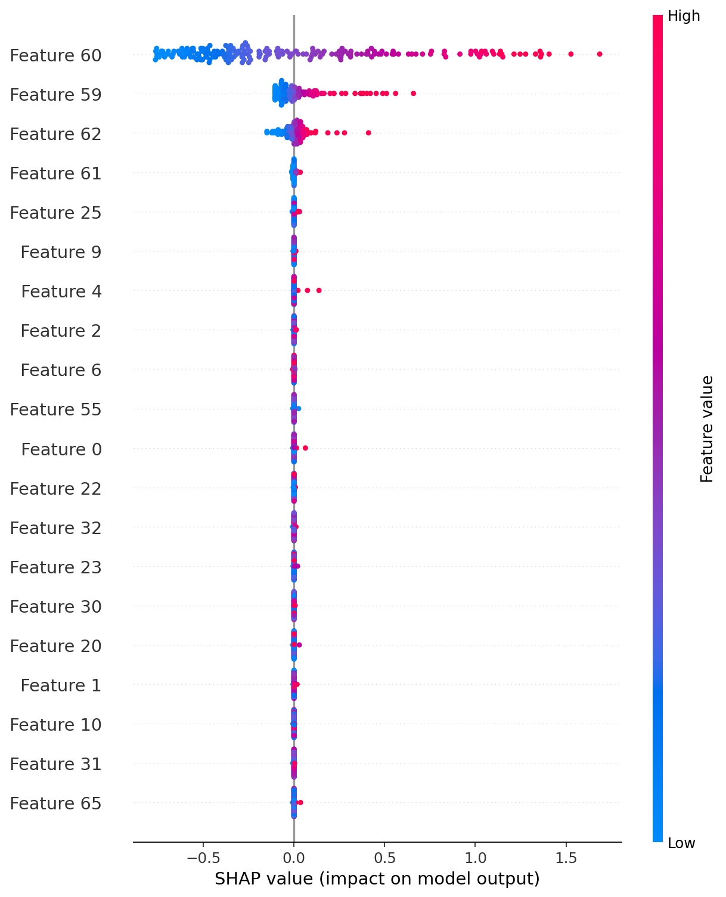
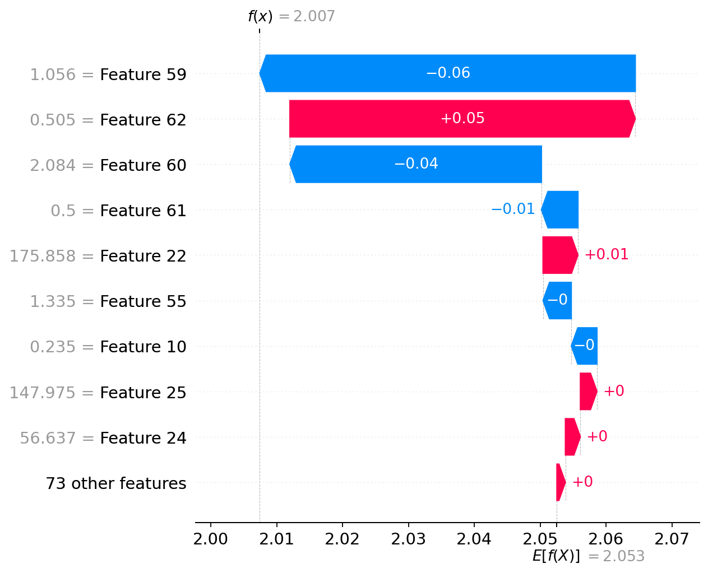

# ML Capacity Planning for Heterogeneous Databases (Telemetry -> Clusters -> P50/P95)

End-to-end reference implementation of a capacity planning system that:
1) clusters workload patterns from telemetry (heterogeneous DB fleet)
2) predicts baseline and peak compute needs via quantile boosted-tree models (P50/P95)
3) adds explainability + drift-aware retraining to reduce overprovisioning and prevent slowdowns

## Quickstart
```bash
python -m venv .venv
source .venv/bin/activate
pip install -r requirements.txt

python scripts/generate_synthetic.py --days 90 --n_dbs 120
python scripts/train.py
python scripts/predict.py --input data/raw/telemetry.csv --output reports/predictions.csv
python scripts/drift_check.py --maybe_retrain
```

## Docs
See `docs/` for overview + schema + extension ideas.

## License
MIT


## Architecture


## Demo Pipeline


## Design Decisions
See: `docs/design_decisions.md`

## Explainability (SHAP)
After training, generate SHAP explanations:
```bash
python scripts/explain_shap.py --quantile 0.95
```
Artifacts: `reports/shap/`

## Metrics Visualization
Generate plots:
```bash
python scripts/plot_metrics.py
```
Artifacts: `reports/plots/`


## Example Outputs (After Training)

### Metrics



### SHAP Explainability



> These images are generated after running:
> ```bash
> python scripts/train.py
> python scripts/plot_metrics.py
> python scripts/explain_shap.py --quantile 0.95
> ```
